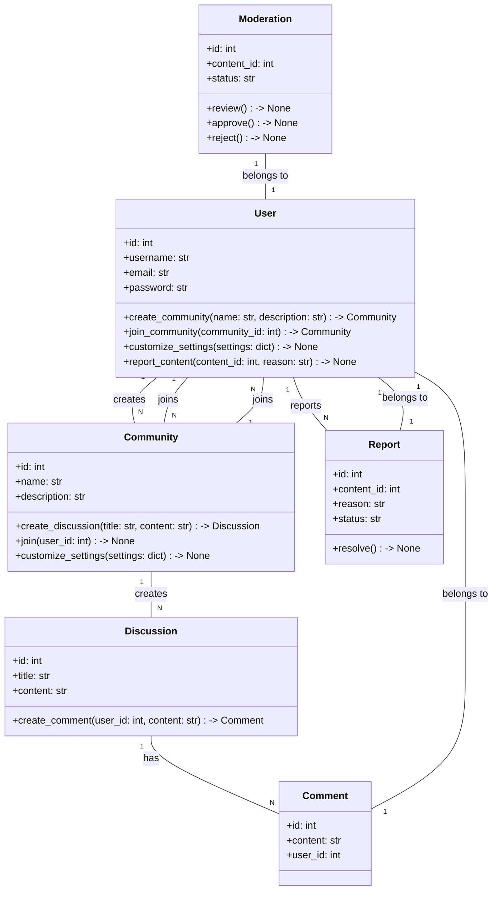
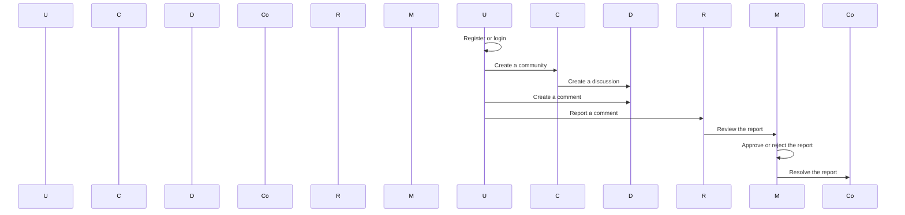

## Implementation approach
To implement the community site with AI-assisted content moderation, we will use the following approach:

1. Design the database schema to store user information, communities, discussions, comments, and reported content.
2. Implement user authentication and authorization using a framework like Django, which provides built-in authentication and authorization functionalities.
3. Create the necessary API endpoints for community creation, joining, and customization using a framework like Django REST framework.
4. Integrate the GPT-4 API for content moderation, using the API to filter out harmful content and continuously improve based on user feedback.
5. Implement reporting functionality for users to report inappropriate content, and create a moderation dashboard for administrators to review and address reported content.
6. Design the UI using a frontend framework like React or Vue.js, with responsive layouts for different devices.
7. Test the system thoroughly, including unit tests for each component and integration tests for the overall system.
8. Deploy the system to a production environment, using tools like Docker and Kubernetes for containerization and orchestration.

## Python package name
```python
"community_site"
```

## File list
```python
[
    "main.py",
    "models.py",
    "views.py",
    "serializers.py",
    "urls.py",
    "gpt4.py",
    "database.py",
    "reporting.py",
    "moderation.py",
    "tests.py",
    "Dockerfile",
    "kubernetes.yaml"
]
```

## Data structures and interface definitions


## Program call flow


## Anything UNCLEAR
The requirements are clear to me.